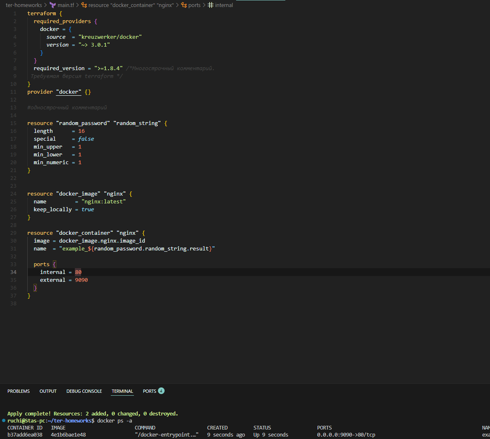
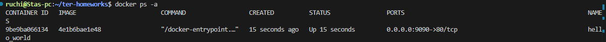
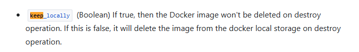

## Задание 1

#### 2. 
personal.auto.tfvars

#### 3. 
Lj2wuENw61MSnPaD

#### 4. 
Имя должно начинаться с буквы или символа подчеркивания
Ссылаемся на несуществующий ресурс с image(он закомментирован и в нем не указано имя)
Не правильно указана переменная(с ошибками)

#### 5. 


#### 6.

Опасность в том, что он может уничтожить рабочие ресурсы. 
-auto-approve делается в ci/cd, в первом шаге всегда делается plan. apply же содержит в себе plan ожидающий поддверждения, поэтому во втором шаги, когда делается apply, нужен ключ -auto-approve.


```
{
  "version": 4,
  "terraform_version": "1.11.2",
  "serial": 11,
  "lineage": "4e9be60b-fd14-daf5-afdd-22845aedecfd",
  "outputs": {},
  "resources": [],
  "check_results": null
}
```
#### 8.

команда keep_locally не дает удалить загруженный образ